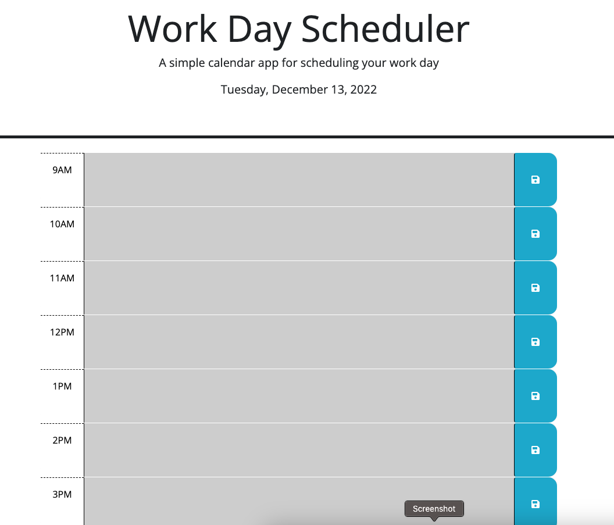

# Work-Day-Scheduler-Challenge

**[View Deployed Site](https://joshf2797.github.io/Work-Day-Scheduler-Challenge/)**

 

## This is a scheduler keeper for a regualr work day

 

The purpose of this application is to keep a schedule during the user work day. The user will be shown a set of boxes where they can enter a text for the corresponding time of day in which they would like to add a task or todo to. After entering a text, the user will click the save button and the information will be saved even after reloading the page. The boxes will changes colors depending on the time of day.

 

## This is what the user will see when first opening the page.

 

## The user will be able to add what they want to any time block they wish and save what they entered.

 

## The user will see the colors of the boxes change as the time of day changes. Grey boxes for the time that has already past. Red boxes for the current hour of the day. And purple boxes for future hours.

 

This application was made using html, CSS, Javascript, and JQuery.
